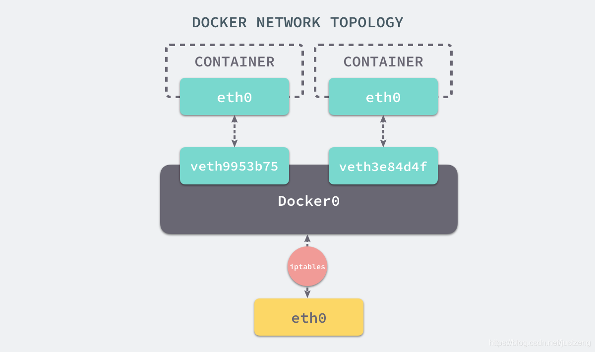

# Docker

## LXC +AUFS
- LXC：
  - Control Groups：隔离物理主机上的资源，如CPU、内存、磁盘I/O、网络带宽等
  - Namespace：命名空间隔离资源，PID
  - Veth：虚拟网卡（连接两个点的通信）、虚拟网桥（多个虚拟网卡的一端连接的同一个代理点）、虚拟网关
  - chroot：修改根目录，限制用户权限
- AUFS：将不同目录挂载到同一个虚拟文件目录下
