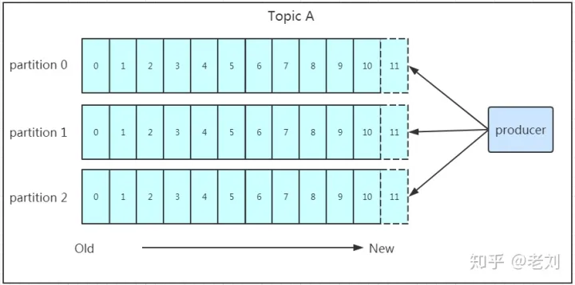
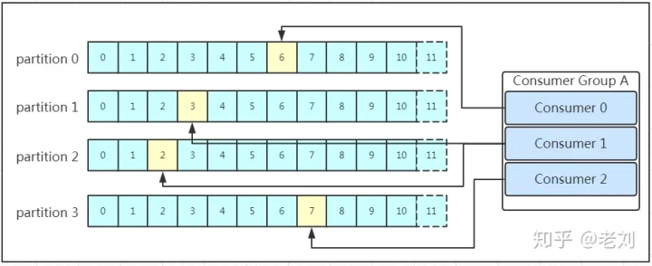

# Kafka的设计与实现

## 生产者消费者模型
- 生产者：写入消息
  - 消息有序
  - 支持并发写
  - 数据不丢失
- 消费者：消费消息
  - 支持重复消费
  - 消费消息有序
  - 多个节点并发消费，且不能重复消费
- 存储：过期或旧数据自动删除
  - 旧数据自动删除
  - 消息备份

## 消息中间件的功能
- 解耦：生产者和消费者不互相依赖
- 异步：生产者产生的消息，消费者不必立即处理
- 削峰：各个时间段产生的数据量大小不一，但是我的消费者在生产者的高峰期时间内处理不完数据，那么就可以用消息中间件将消息分流到每个时间段处理

## 消息队列的两种模式
- 点对点模式：只能有一个消费者，消费者主动拉取消息
- 发布订阅模式：服务主动推送消息给消费者

## Kafka架构图

### kafka术语
- producer：生产者，项kafka写入消息
- kafka cluster：kafka集群
- consumer：消费者，从kafka集群中读取消息
- message：消息
- consumer group：消费者组

#### kafka cluster
- broker：节点，是kafka实例（运行kafka的进程），每个节点都有一个不重复的ID编号
- topic：消息的主题，对消息进行分组，kafka的消息数据就保存在自己的topic下，每个broker可以创建多个topic
- partition：topic主题的分区，一个topic+partition对应一个唯一的文件夹，可以理解为把一个大文件分割成多个文件，然后多个文件放到不同的文件夹中，这些文件夹一起存放这个topic完整的数据。分区的作用是做负载，提高kafka的吞吐量的，且数据不重复。
- replication：副本，每一个分区partition可以有多个副本，副本就是备份数据，做备胎。当主分区leader故障的时候，会重新选择一个备胎副本上位做leader。副本的数量不能大于节点数量，follower和leader不在同一个broker，同一个broker对同一个分区只能存放一个副本包括自己。
- consumer group：将多个同一个topic下的消费者组成一个组。同一个topic下的同一个分区的数据只能被一个消费者消费，同一个消费者可以消费同一个topic下的不同分区partition（为了提高吞吐率，提高消费速率）

### kafka工作流程

#### 发送消息 Producer
生产者是消息的入口，kafka中消息发送永远只消kafka集群的leader发送，不会将数据写入follower。那么kafka的producer是怎么找到topic下分区的leader的呢？

##### 同一个topic下多个分区，producer怎么知道该往哪个分区发送数据呢？
- 写入时指定写入哪个partition
- 如果没有指定写入partition，但是设置了分区key，则会将消息按照key的hash值写入对应的partition
- 如果没有指定partition和key，则会轮询出一个partition写入。

### kakfa消息存储
kafka利用分段+索引来提高查询效率的。

- .index：索引
- .timeindex：时间索引
- .log：消息数据

#### log文件的消息结构
主要结构：
- offset：偏移量，8byte的唯一有序ID，可以确定每条消息在partition中的位置
- 消息大小：描述消息的大小
- 消息体：压缩过的消息

#### 消息存储策略
无论消息是否被消费，消息都会被存储，存储策略：
- 基于时间：默认存储7天
- 基于大小：默认1073741824=1G

### consumer 消费者
消息存储到.log文件后就可以消费了，consumer是主动拉取消息消费，跟producer先找leader一样，consumer也是先找leader再消费。一个消费者可以消费多个partition，但是同一个partition只能被一个consumer消费。如果有多的consumer，那么该多出的consumer将空闲。因此建议消费者组的consumer数量和partition的数量一致。

## 问题
### 为什么要设计分区？
- 方便扩展：同一个topic可以有多个分区，当数据多了的时候可以增加机器来增加分区。broker数量一般大于等于partition数量，一个partition对应一个磁盘
- 提高并发：同一个topic的同一个分区只能被一个消费者消费，但是同一个消费者可以可以消费多个分区。可以做的多个消费者消费多个分区，增加了消费速率

### kafka如何保证消息不丢失？
通过follower的主动ack应答。producer向集群推送消息，是只推送给leader节点分区，然后follower从leader主动pull拉取数据，拉取完毕后向leader发送ack应答，确保follower同步消息完成。通过设置ack级别可以达到不同的丢失率保证：
- 1：默认，leader写入完毕即向producer发送ack
- 0：不等待集群返回ack，即不保证数据不丢失
- -1或all：所有follower同步完成

### kafka是怎么提高查询效率的？
segment分段+有序offset+稀疏索引+二分查找+顺序查找
kafka的partition分区中文件存储的格式是分成多个段（segment），每个段有多个文件组成：(.index，.timeindex，.log组成)，kafka的分区中的数据是有序的，每条消息都有一个唯一的offset ID，而每段segment的文件命名是按照offset命名的，因此每个partition的文件都是有序可快速查找的，其中.index和.timeindex都是稀疏索引，可以利用二分查找加快查找效率。
