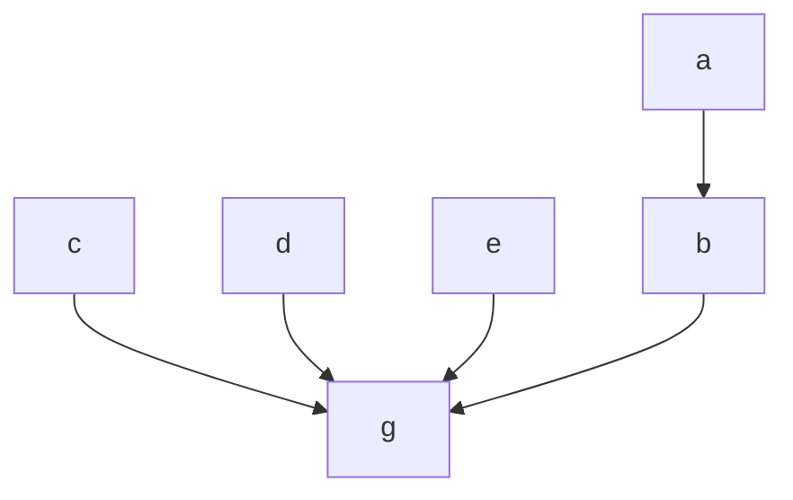

# Golang文档链接地址

## [go 官网](https://go.dev/doc/)

## [go 标准库](https://studygolang.com/pkgdoc)

## [go 指南](https://tour.go-zh.org/methods/11)

## [go env配置详解](https://github.com/goproxyio/goproxy.io/blob/master/content/zh/docs/GOPRIVATE-env.md)

## [go设计与实现](https://draveness.me/golang/)

