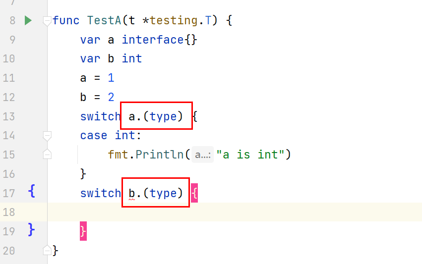

# Golang基础总结
## 1. make 和 new 的区别
    make和new的定义：
    ```golang
    func make(t Type,size ...IntegerType) Type
    
    func new(Type) *Type
    ```
    区别：
    - 返回值类型不同，make返回类型值，new返回类型的指针
    - 参数不同，make只能用于slice,map,chanel的初始化，new可以用于任意类型
    - make是分配内存并初始化，new是只分配内存并返回类型的零值指针

## 2. 类型断言使用条件

    类型断言只能作用于interface类型的变量，其他类型使用断言会报语法错误。
    


## 进阶

### 切片底层
切片的结构：
type slice struct {
  p unsafe.Pointer
  len int
  size int
}

### map结构底层

### Golang内存模型
golang的内存模型阐述了一个go程对某个变量的写操作，满足那些条件才能确保被另一个读取该变量的go程检测到。内存模型的本质就是限定写事件和读事件发生的顺序需要满足的条件：
1. 对某变量的写W操作必须发生在该变量的读R操作之前。（保证多go程对同一个变量的读写操作有序）
2. 在该写W操作之后和该读R操作之前，没有其他go程对该变量进行写W操作。（确保该变量的读和写唯一）

		这两个条件限定了，对同一个变量的读和写有序且唯一
		
		
### GMP