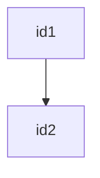
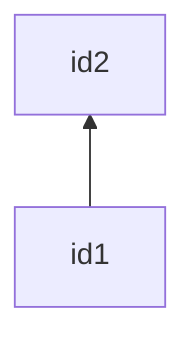
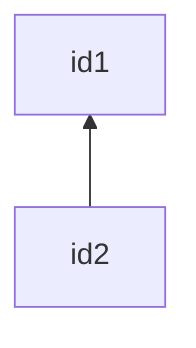
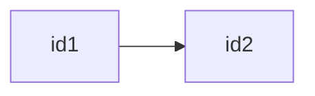
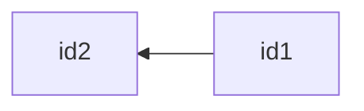
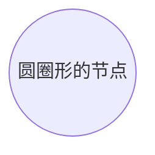

# 语法
- 图表标题
    ```markdown
    ---
    title: 标题
    ---
    ```
- 箭头：
    ```markdown
    -->
    ```
- 圆角方框：
    ```markdown
    id("圆角方框")
    ```
- 半圆方框：
    ```markdown
    id(["半圆方框"])
    ```
- 子程序方框：
    ```markdown
    id[["子程序方框"]]
    ```
- 圆柱形：
    ```markdown
    id[("圆柱形")]
    ```
- 圆形：
    ```markdown
    id(("圆形"))
    ```
- 不对称方框：
    ```markdown
    id>"不对称方框"]
    ```
- 菱形：
    ```markdown
    id[/"菱形"/]
    ```
- 六边形：
    ```markdown
    id{{"六边形"}}
    ```
- 平行四边形：
    ```markdown
    id[/"平行四边形"/]
    id[\"平行四边形"\]
    ```
- 梯形：
    ```markdown
    id[/"梯形"\]
    id[\"梯形"/]
    ```
- 双圆形：
    ```markdown
    id((("双圆形")))
    ```
- 图表连接方向：
    ```markdown
    flowchart LR
    或
    flowchart TD
    或
    flowchart TB
    # TB - Top to bottom，从上到下
    # TD - Top-down same as top to bottom，从上向下
    # BT - Bottom to top，从底向上
    # RL - Right to left，从右向左
    # LR - Left to right，从左向右
    ```
- Unicode文本：使用""双引号包裹起来
    ```markdown
    "Unicode文本"
    ```
- 在文本中使用markdown语法显："``" 反引号引用markdown语法
    ```markdown
    "`**加粗**`"
    ```
- 内容换行：
    ```markdown
    idx["a
    b
    c"]
    ```
- 图标类型：
  - 流程图：flowchart、graph

# 示例

## 方块


或

**示例代码**：
```markdown
---
title: 方块
---
flowchart
    id1["方块1"]
    id2["方块2"]
```
或
```markdown
---
title: 方块
---
graph
    id1["方块1"]
    id2["方块2"]
```


## 箭头

### 从上到下
- 默认

**示例代码**：
```markdown
    ```mermaid
    graph
        id1["id1"]
        id2["id2"]
        id1-->id2
    ```
```

### 从上到下(TB或TD)

**示例代码**：
```markdown
    ```mermaid
    graph TB
        id1["id1"]
        id2["id2"]
        id1-->id2
    ```
```


**示例代码**：
```markdown
    ```mermaid
    graph TD
        id1["id1"]
        id2["id2"]
        id1-->id2
    ```
```


**示例代码**：
```markdown
    ```mermaid
    graph BT
        id1["id1"]
        id2["id2"]
        id1-->id2
    ```
```


**示例代码**：
```markdown
    ```mermaid
    graph BT
        id1["id1"]
        id2["id2"]
        id2-->id1
    ```
```

### 从左到右

**示例代码**：
```markdown
    ```mermaid
    graph LR
        id1["id1"]
        id2["id2"]
        id1-->id2
    ```
```

### 从右到左

**示例代码**：
```markdown
    ```mermaid
    graph RL
        id1["id1"]
        id2["id2"]
        id1-->id2
    ```
```

## 节点形状（Node shapes）

### 圆角形状

**示例代码**：
```markdown
    ```mermaid
    flowchart
        id1("圆角")
    ```
```

### 半圆方框

**示例代码**：
```markdown
    ```mermaid
    flowchart
        id1(["半圆方框"])
    ```
```

### 子程序形状的节点

**示例代码**：
```markdown
    ```mermaid
    flowchart
        id1[["子程序形状的节点"]]
    ```
```

### 圆柱形的节点

**示例代码**：
```markdown
    ```mermaid
    flowchart
        id1[("圆柱形的节点")]
    ```
```

### 圆圈形的节点

**示例代码**：
```markdown
    ```mermaid
    flowchart
        id1(("圆圈形的节点"))
    ```
```

### 不对称形状的节点

**示例代码**：
```markdown
    ```mermaid
    flowchart
        id1>"不对称形状的节点"]
    ```
```

### 菱形


**示例代码**：
```markdown
    ```mermaid
    flowchart
        id1{"菱形"}
    ```
```

### 六边形节点

**示例代码**：
```markdown
    ```mermaid
    flowchart
        id1{{"六边形节点"}}
    ```
```

### 平行四边形

**示例代码**：
```markdown
    ```mermaid
    flowchart
        id1[/"平行四边形"/]
    ```
```


**示例代码**：
```markdown
    ```mermaid
    flowchart
        id1[\"平行四边形"\]
    ```
```

### 梯形

**示例代码**：
```markdown
    ```mermaid
    flowchart
        id1[/"梯形"\]
    ```
```

```mermaid
flowchart
    id1[\"梯形"/]
```
**示例代码**：
```markdown
    ```mermaid
    flowchart
        id1[\"梯形"/]
    ```
```

### 双圆型
```mermaid
flowchart
    id1((("双圆型")))
```
**示例代码**：
```markdown
    ```mermaid
    flowchart
        id1((("双圆型")))
    ```
```

## 线

### 箭头
```mermaid
graph LR
    A-->B
```
```markdown
    ```mermaid
    graph LR
        A-->B
    ```
```

### 连实线
```mermaid
graph LR
    A---B
```
```markdown
    ```mermaid
    graph LR
        A---B
    ```
```

### 文本连线
```mermaid
graph LR
    A-- "是" --- B

    C--- |"是"| D

    E-->|是| F
    E--是 --->F
```
```markdown
    ```mermaid
    graph LR
        A-- "是" --- B

        C--- |"是"| D

        E-->|是| F
        E--是 --->F
    ```
```
### 虚线
```mermaid
graph LR
    A-.-B
    A-.->B
    A-. "是".->B
```

```markdown
    ```mermaid
    graph LR
        A-.-B
        A-.->B
        A-. "是".->B
    ```
```
### 粗箭头
```mermaid
graph LR
    A==>B
    A== 是 ==>B
```

```markdown
    ```mermaid
    graph LR
        A==>B
        A== 是 ==>B
    ```
```
## 子图
```mermaid
graph TB
    subgraph one
    A1-->A2
    end
    subgraph two
    B1-->B2
    end
    subgraph three
    C1-->C2
    end
    A1-->B2
    C2-->B2
```

```markdown
    ```mermaid
    graph TB
        subgraph one
        A1-->A2
        end
        subgraph two
        B1-->B2
        end
        subgraph three
        C1-->C2
        end
        A1-->B2
        C2-->B2
    ```
```


# 流程图
> 关键字 flowchart，可以使用graph替换

### 二叉树
```mermaid
graph TD;
A-->B;
A-->C;
B-->D;
B-->E;
```
```markdown
    ```mermaid
    graph TD;
    A-->B;
    A-->C;
    B-->D;
    B-->E
    ```
```
