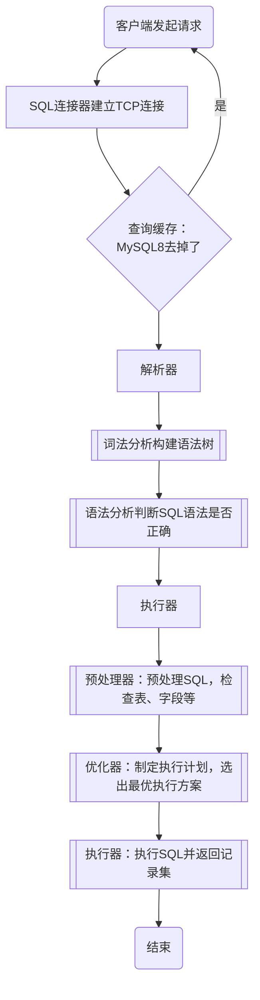
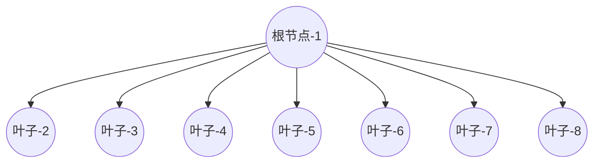
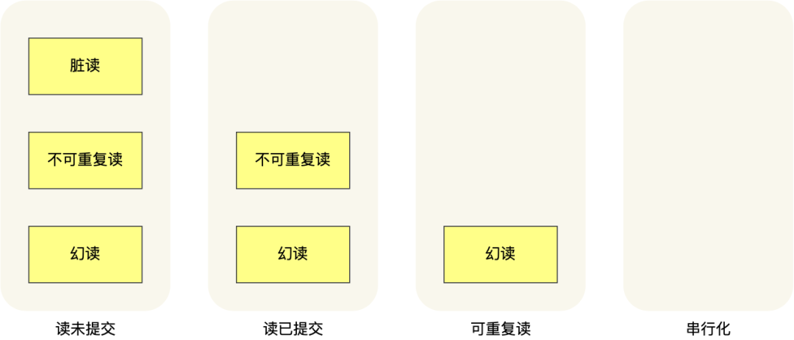
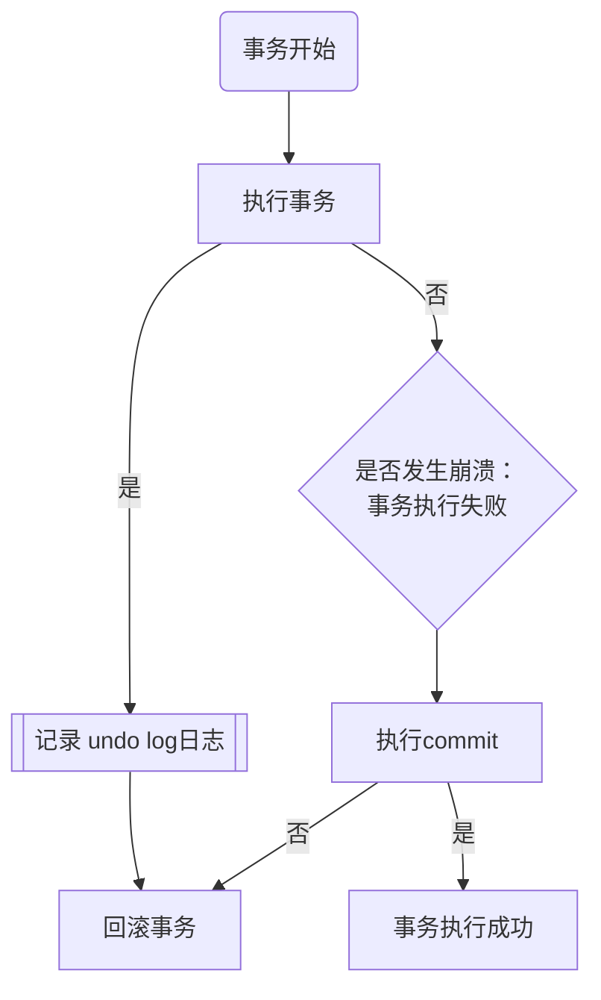
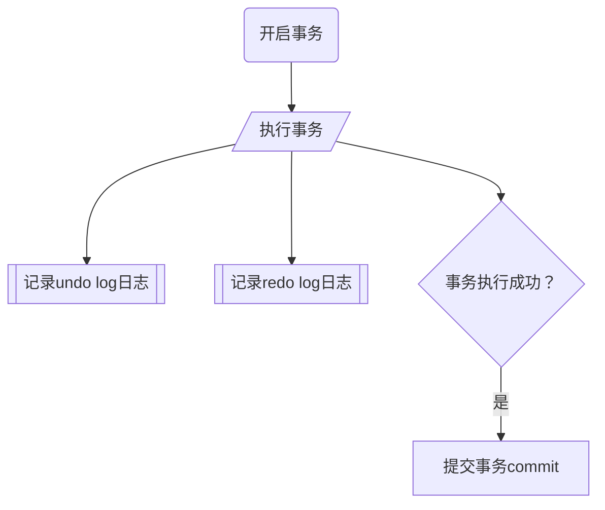

# MySQL

## 常用操作命令
- mysql -h$ip -u$user -p ：登录mysql服务
- show processlist：查看当前mysql服务有多少客户端连接
- kill connection +连接ID：手动端口空闲连接
- show variables like 'max_connections'：查看mysql最大支持的连接数

## 一条查询SQL语句的执行顺序是怎样的？[待定]
示例SQL：

## SQL执行流程
### 执行一条SQL语句，期间发生了什么？
- 连接器：MySQL基于TCP协议建立连接的，建立连接，管理连接、验证身份密码
- 查询缓存：如果查询命中查询缓存，则直接返回查询结果，否则向下执行，8.0已删除查询缓存（为什么）
- 解析器解析SQL：对SQL语句进行词法分析构建语法树、语法分析，
- 预处理器：检查表和字段是否存在，展开*为全部字段
- 优化器：选择查询成本最小的执行计划
- 执行器：根据执行计划执行SQL语句，从存储引擎读取记录返回给客户端




### 连接器
与MySQL服务器建立TCP连接：
```bash
$ mysql -h$ip -u$user -p回车输入密码
```
- -h：mysql服务的IP地址，如果是在本机上可以不填
- -u：用户名
- -p：密码

### 查询缓存

### 解析器
- 词法分析：根据输入的SQL语句，分析出关键字，构建SQL语法树
- 语法分析：根据词法分析构建的语法树，判断输入的SQL语法是否正确，不正确直接抛出异常结束

### 执行SQL-预处理器
- 判断SQL语句中的表和字段是否存在
- 对select * 的 * 展开为表的字段

### 执行SQL-优化器
为输入的SQL制定一个执行计划，优化器基于查询成本来决定使用哪一个索引来查询

### 执行器
与存储引擎交互获取记录集

#### 索引下推

## 索引
### 索引分类
- 按数据结构：B+Tree索引、Hash索引、Full-Text索引
- 按物理存储：聚簇索引（主键索引）、二级索引（辅助索引）
- 按字段特性：主键索引、唯一索引、普通索引、前缀索引
- 按字段个数：单列索引、联合索引

### B+Tree索引
- 非叶子节点只存储索引，叶子节点存放数据
- 每一个叶子节点都有两个指针，分别存放上一个节点和下一个节点，构成双休链表
- 索引和数据都存储在磁盘，读取一个节点相当于一次IO操作
- B+Tree 存储千万级的数据只需要 3-4 层高度就可以满足，意味着存储千万数据只需要最多3-4次IO就可以找到，查询效率相对于二叉树和B树高很多


### 主键索引
主键索引的非叶子节点只存放主键（索引值），叶子节点存放完整的行记录信息和上一个及下一个节点的指针

### 二级索引
二级索引的非叶子节点只存放索引值，叶子节点存放主键值，并不存储实际数据

### 回表
通过二级索引（辅助索引，按物理存储）查询到记录的主键，在通过主键到主键索引获取这个主键对应的行数据的过程叫回表。简单点说，就是需要查询两次B+Tree树索引（二级索引+主键索引）才能获取到结果的查询过程叫回表。
示例SQL：
```sql
select * from users where name = 'a'
```
其中name字段建立了B+Tree索引，主键是ID。此时为了获得name = a 的用户的详细信息，需要先在name索引上查找到主键，再回表按照主键索引查询获得a用户的记录。

### 覆盖索引
在二级索引中就可以查询到结果的查询过程就叫覆盖索引查询。
示例SQL：
```sql
select id from users where name = 'a'
```
其中name字段建立了B+Tree索引，主键是ID。因为name索引的叶子节点上存放的是主键的值，就是这个a用户的主键id值，此时不用回表获取结果，直接从二级索引中获得了结果的查询过程就叫覆盖索引查询。

## ruhe 计算表的数据量
定义：
- Deep：B+Tree的深度，根节点深度为0
- PageSize：定义Mysql设置的数据页大小
- IndexSize：定义非叶子节点每个索引占用空间大小
- RowSize：定义叶子节点每行数据的大小
- Rows：定义深度为Deep的B+Tree，在MySQL的数据页大小为PageSize，且索引大小为IndexSize，每条数据记录大小约为RowSize时，可以存储多少行数据

### 深度为1的B+Tree，每条数据大小为1kb

MySQL一个数据页大小为：$$PageSize=16KB = 16 * 1024B$$ ，页指针(8字节)和索引值大小(6字节)和为：$$IndexSize = 14B$$
那么，在B+Tree深度为：$$Deep=1$$时 ，非叶子节点存储索引个数：$$PageSize/RowSize=16$$ 
那么根节点a1能够存储的索引数量是：$$PageSize/IndexSize=16*1024/14=1170个$$ 
表明最多可以有1170个子节点，则可以计算出大约得最大行数：$$1170*16=18724$$
依次类推深度为2的B+Tree，可以有节点数量：$$1170*1170=1368900$$个叶子节点，那么最大数据行数约为：$$1170^2*16=21902400$$ 大约2000万条记录。由此可以推导出计算公式：
$$Rows = (PageSize / IndexSize )^{Deep}*(PageSize/RowSize)$$

在当前条件下，可以替换为：
$$Rows = 1170 ^ n*16，其中n为B+Tree的深度$$

### 问题

#### 为什么才有B+Tree树而不是BTree树作为MySQL索引的结构？
- B+Tree只有叶子节点存储数据，而BTree数据的非叶子节点也要存储数据，所以B+Tree的单个节点的数据量更小，在相同磁盘IO此次下，B+Tree可以查询更多的节点
- B+Tree的叶子节点采用的是双向链表，更适合MySQL的范围查询，而BTree无法做到这一点。

#### B+Tree vs Hash
Hash索引更适合做等值查询，但是不适合做范围查询


#### B+Tree vs 二叉树
二叉树的子节点最多只能有两个，这样会造成数据量越大，二叉树的层数越高，查询的IO次数越多，性能越差，而B+Tree的子节点可以有很多个，可以减少磁盘的IO次数。


## MySQL事务
为了解决一次执行多条SQL，要么全部执行成功，要么全部失败，全部执行成功后持久化到磁盘，失败后数据回滚到前一个版本，且并发条件且多个批量执行互不干扰，因此设计了事务。综上事务需要满足以下的特性：
- 原子性：要么都成功，要么都失败。回滚日志undo.log保证
- 隔离性：不同事务相互之间互不干扰。多版本控制MVCC和锁机制保证
- 持久性：一旦执行成功提交了数据，需要存储到磁盘，保证不丢失。重做日志redo.log保证
- 一致性：事务前后需要保证数据完整，相对不能凭空减少或变多。通过原子性、隔离性、持久性一起保证。

### 并行事务引发的问题？
- 脏读：一个事务读取到了另一个事务修改了但是还未提交的数据
- 不可重复读：一个事务内多次读取同一条数据，前后读取的数据不一样
- 幻读：一个事务内按照某个条件多次查询数据，前后读取的记录数（条数）不一致

### 事物的隔离级别
为了解决事务执行时遇到的脏读、不可重复读、幻读问题而出现的事务隔离级别。级别越高性能越差。
事务隔离级别：低到高
- 读未提交：一个事务还未提交时，这个事务对数据所做的变更就可以被其他事务读取到。
- 读已提交：一个事务只有提交了，这个事务对数据的修改变更才能被其他事务读取到。
- 可重复读：一个事务执行过程中所看到的数据，始终跟这个事务开始时读取到的数据一致。InnoDB默认的隔离级别
- 串行化：会对记录加上读写锁，多个事务对这条记录进行读写操作时，如果发生了读写冲突，后访问的事务必须等待前一个事务执行完毕，才能继续执行。



MySQL在可重复读隔离级别下很大程度上解决了幻读，但是并没有彻底解决。
- 针对快照读 select 查询，通过MVCC
- 针对当前读 select for update。通过next-key lock记录锁+间隙锁解决幻读

## Mysql日志
- 回滚日志：undo log
- 重做日志：redo log
- 归档日志：binlog

### 回滚日志 undo log
    有InnoDB存储引擎生成的日志，实现了事务中的原子性，主要用于事务回滚和MVCC。

#### 设计undo log的作用？
    MySQL在执行普通增删改SQL时，虽然我们没有明确声明开启事务，但是Mysql会隐式开启事务，执行完毕后执行自动提交。

##### 问题场景：当我们在执行事务SQL时，如果还没commit修改的数据，MySQL崩溃了，要怎么回滚到之前的数据呢？
    在事务执行过程中记录下需要回滚的数据信息到一个日志文件中，当需要回滚时从这个日志文件中回滚，实现这一机制的就是回滚日志 undo log，它保障了事务的原子性。事务执行流程如下：

##### undo log的具体执行过程
事务开启后：
- ***插入*** 一条记录时，将插入数据的ID记录下来，失败后删除掉这个ID的数据
- ***修改*** 一条记录时，将该条记录的将要被更新的列的旧值记录下来，在回滚时更新为旧值
- ***删除*** 一条记录时，将该条记录的内容记录下来，在回滚时重新插入这条记录
一条记录每次更新产生的undo log日志的格式都会有一个：roll_pointer 回滚指针 和 trx_id 事务ID
- roll_pointer：通过这个指针，将索引B+Tree的记录和undo log记录串联起来，组成一个链表，这个链表就是版本链，用来实现MVCC版本控制。
- trx_id：记录事务ID，记录该条日志是哪个事务产生的。

***B+Tree的每一条记录上都有两个特殊的字段：trx_id事务ID 和 roll_pointer 回滚指针，roll_pointer用于和undo log日志关联起来，trx_id用来记录当前的事务ID***

### MVCC多版本并发控制
    MVCC是通过ReadView(快照读)和Undo log的版本链实现的。对于 ***读提交*** 和 ***可重复读*** 隔离级别的事务，它们的快照读（普通select语句）是通过ReadView+undo log实现的，区别在于生成的ReadView快照时机不同。按照各自的条件在undo log版本链中找到可见的版本数据控制事务访问的源数据。
- ***读提交***：在每个select都会生成一个新的 ReadView，意味着一个事务中的多个select语句，可能前后读取生成的ReadView不一样，这就会造成同一个select语句可能前后查出的记录集数量不一致，就造成了 ***幻读***
- ***可重复读***：在事务启动时生成ReadView快照，整个事务内都是读取的这个快照的数据，因此可以避免幻读

### Buffer Pool 缓冲池
#### innodb 为什么要设计一个Buffer Pool？
我们来看一下没有缓存区的情况：修改一条数据时，先从磁盘读取出来，在内存中处理这条记录，处理好后更新到磁盘。如果修改数据记录很多，那么每一条都要先从磁盘读取处理，写入内存，修改后再更新到硬盘。这样势必会造成大量的磁盘IO操作及写入硬盘的耗时。那如果在这中间加一个缓冲池呢？现将一部分数据页的数据取出，存放在这个缓冲池中，当有更新时，数据如果在内存中，则直接从缓冲池中取数据更新；如果不在则先从磁盘读出并写入缓冲池，再更新内存中的数据，并将更改后的数据页标记为脏页，让后在后台开启一个线程，在达到一定条件下批量更新写入硬盘，这样不仅减少了磁盘ID，同时页降低了因为数据刷盘导致的性能问题。但是此时如果MySQL崩溃了，或停电了内存中的更新数据就会丢失。从而又引出了新的问题：如何确保掉电恢复及数据的持久化。

- 脏页：该页的内存数据和磁盘中的数据不一致

Buffer Pool会缓存：数据页、索引页、undo页、自适应hash索引、插入缓存页、锁信息等。
- undo页：事务开启后，更新数据钱，会先记录响应的undo log数据。对于修改，会先生成undo log数据，记录旧值，undo log会先写入Buffer Pool中的undo页。

### redo log

#### 为什么需要redo log？（物理日志）
上面介绍到了为了降低IO及提高查询效率和性能，MySQL提供了Buffer Pool功能。但是由于Buffer Pool的数据是存储在内存中的，一旦停电或MySQL崩溃，内存中的脏页数据将会丢失。为了防止断电数据丢失，新增加了redo log日志来记录需要刷盘的数据，从而保证即使断电恢复，仍然可以从redo log（记录某个数据页的修改）冲恢复修改的数据。
#### redo log写入流程

