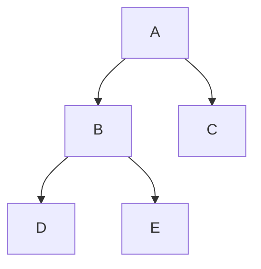

# 数据结构

## 二叉树

每个节点最多只有两个节点的数据结构，它的分支通常被叫做左子树或右子树。其结构示例如下图所示：
- 节点：每个数据节点
- 叶子节点：没有子节点的节点
- 根节点：最顶层的节点
- 高度（从节点到根）：从n节点到根节点的遍数
- 深度（从根到节点）：对于任意节点n,n的深度为从根到n的唯一路径长，根的深度为0。深度$k_0 = 0$，$total_{(k>=0)}=2^k+1-1$
- 层数（从根到节点，和高度相反）：根节点是第一层，第二层为第一层的子节点，层数 $i$ 的节点最大数量：$nodes_{(i>=1)} = 2^i-1$

### 特点
- 节点的子节点最多只能有两个
- 可以退化成链表
- 层数可能非常高

### 遍历
L：左节点
R：有节点
D：根节点
- 前序遍历：D-L-R
- 中序遍历：L-D-R
- 后续遍历：L-R-D

## B+Tree 树
每个节点都可以有N（N>=0）个子节点的有序树状结构。
### 特点
- 节点可以有很多个子节点
- 层数很少，一般3-4层就可以存储非常多的数据
- 非叶子节点不存储数据，只存储索引
- 叶子结点存储数据，且叶子节点的数据会存储上一条和下一条的指针，串联成双向链表，适合范围查询

## BTree 树