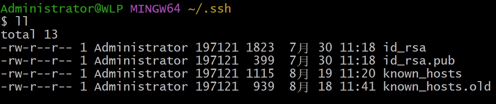

# Linux

## 配置ssh免密登录远程服务器

### 本地生成登录秘钥
打开gitbash，执行：
```bash
ssh-keygen
```
进入目录：~/.ssh：

文件说明：
- id_rsa：私钥
- id_rsa.put：公钥

### 上传ssh公钥到远程服务器
```bash
ssh-copy-id -i ~/.ssh/id_rsa.pub root@xxx.xxx.xxx.xxx
```

### 执行免密登录
```bash
ssh root@xxx.xxx.xxx.xxx
```

### 解决长时间不操作ssh连接断开问题
修改参数：/etc/ssh/sshd_config配置：
```bash
#ClientAliveInterval 0 间隔多少秒向客户端发送请求保活
#ClientAliveCountMax 3 服务器向客户端发送请求后没有收到客户端响应的次数最多值后端口连接

改为：
ClientAliveInterval 60
ClientAliveCountMax 3
```
修改完毕后，执行：
```bash
systemctl restart sshd
```