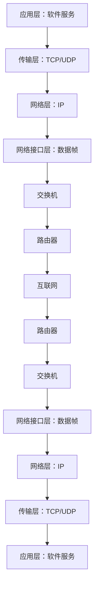
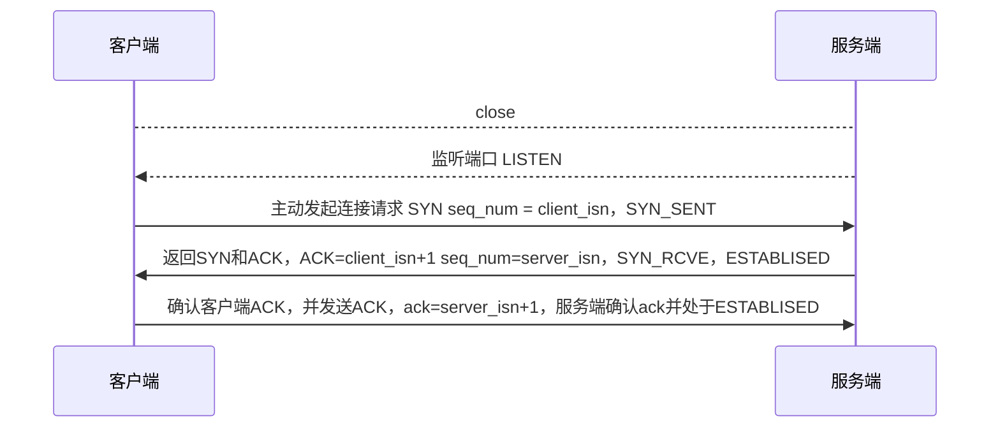

# 网络

## TCP/IP网络模型

- 应用层：为用户提供应用功能，如HTTP、FTP、DNS、SMTP等
- 传输层：为应用层提供网络服务支持：TCP、UDP协议
- 网络层：提供IP协议支持
- 网络接口层：网络层生成IP头部之后，网络接口层想IP头部增加MAC头部，并封装到数据帧发送到网络上

## 浏览器地址栏输入地址回车后发生了什么？
网络请求的流程图：

- URL地址解析：解析出域名、协议、资源路径等，生成HTTP请求消息
- DNS域名解析：向DNS服务器查询域名对应的IP（先查本地，再查远程）
- 操作系统协议栈
- 建立TCP连接：三次握手建立可靠连接
- IP模块：将数据封装成网络包
- MAC：在网络包的IP头部前面加上MAC头部（接收方和发送方的MAC地址）
- 网卡：数据出口，将二进制数据信息转换为电信号发送出去
- 交换机：将网络包原样转发到目的地，交换机工作在MAC层（二层网络设备）
- 路由器：网络包经过交换机后到达路由器，并被转发到下一个路由器或目标设备
- 数据抵达服务器后逐层解析

## TCP三次握手
客户端一发一收，服务端一收一发，客户端和服务端共经历3次确认（握手）
- 第一次：开始客户端向服务端都处于closed状态，服务端主动监听某个端口并处于Listen监听状态，客户端主动发起连接请求，发送SYN=client_isn序列号后处于SYN-SENT状态
- 第二次：服务端收到连接请求后，返回SYN=server_isn，并且ACK=client_isn+1客户端的SYN后处于SYN-RCVD状态
- 第三次：客户端收到服务端发送的SYN和ACK后，向服务端发送SYN确认的ACK==server_isn+1后处于ESTABLISHED状态

1. 为什么是三次握手，而不是四次或五次六次？
   因为对于客户端和服务端建立起可靠连接，需要客户端告诉服务器准备好了，可以发送数据了，同时服务端也要告诉客户端准备好了可以接收了，这个过程首先需要客户端向服务端发起确认是否可以建立连接，服务端收到信号后告诉客户端准备好了，客户端发送邀约请求需要一次，服务端告诉客户端准备好了一次，此时客户端准备OK，服务端也要告诉客户端是否准备好，因此也需要向客户端发送信号，告诉服务端可以发送了，同时客户端也要向服务端发送确认信号，这么看共需要四次，但是可以看到服务端回复客户端和服务端第一次通知客户端是可以合并的，因此只需要3次握手就够了，增加4次5次就是重复的非必要操作。

## HTTPS
在HTTP和TCP/IP协议之间增加一层SSL/TLS协议：
- 客户端向服务器索要并验证服务器的公钥
- 双方协商生成 **会话秘钥**
- 双方采用 会话密钥进行加密通信

基于RSA算法的TLS握手过程：
首先HTTP三次握手建立连接，然后
- 客户端与服务器第一次握手：
    - 发送客户端支持的TLS版本号
    - 发送客户端生成随机数（用于生成会话秘钥）条件之一
    - 发送客户端支持的密码套件列表，如RSA加密算法
- 服务端回复客户端
    - 确认TLS版本号，如果浏览器不支持则关闭加密通信
    - 服务器生成随机数，用于后面的会话秘钥条件
    - 确认密码套件，如RSA算法
    - 告诉客户端服务器使用的证书
- 客户端回应服务端
    - 客户端收到服务端的证书信息后通过浏览器或操作系统中的CA公钥确认服务器数字证书的有效性，如果有效则从证书中获取服务器的公钥，然后使用它加密报文，向服务器发送信息
      - 一个随机数，被服务器公钥加密（服务器和客户端都是同一个）
      - 加密通信算法改变通知，告知服务器随后的信息使用会话密钥加密通信
      - 客户端握手结束通知，同时把之前所有内容发生的数据做个摘要，给服务器做校验
- 服务器最后回应
    - 服务器收到客户端的第三个随机数pre-master-key后，通过协商加密算法计算出本次通信的会话秘钥，然后向客户端发送最后的消息：
      - 加密通信算法改变通知，表示随后的信息都将使用会话秘钥加密通信
      - 服务器握手结束通知，同时把之前所有内容的发送数据做个摘要，供客户端校验。之后整个TLS握手结束，后面的通信就是使用HTTP协议，把要发送的数据用最后生成的会话秘钥加密后发送

## HTTP1.1 HTTPS HTTP2

### HTTP2相对于HTTP1.1：
优势：
- 头部压缩：服务器和客户端同时维护一张头信息表，建立一个索引号，减少相同头的发送
- 二进制格式：报文采用二进制
- 并发传输：多个stream服用一条tcp连接
- 服务器主动推送资源
缺点：
- 队头阻塞：当前一个数据未到达时，后续先到达的只能放在内核缓冲区中等待
