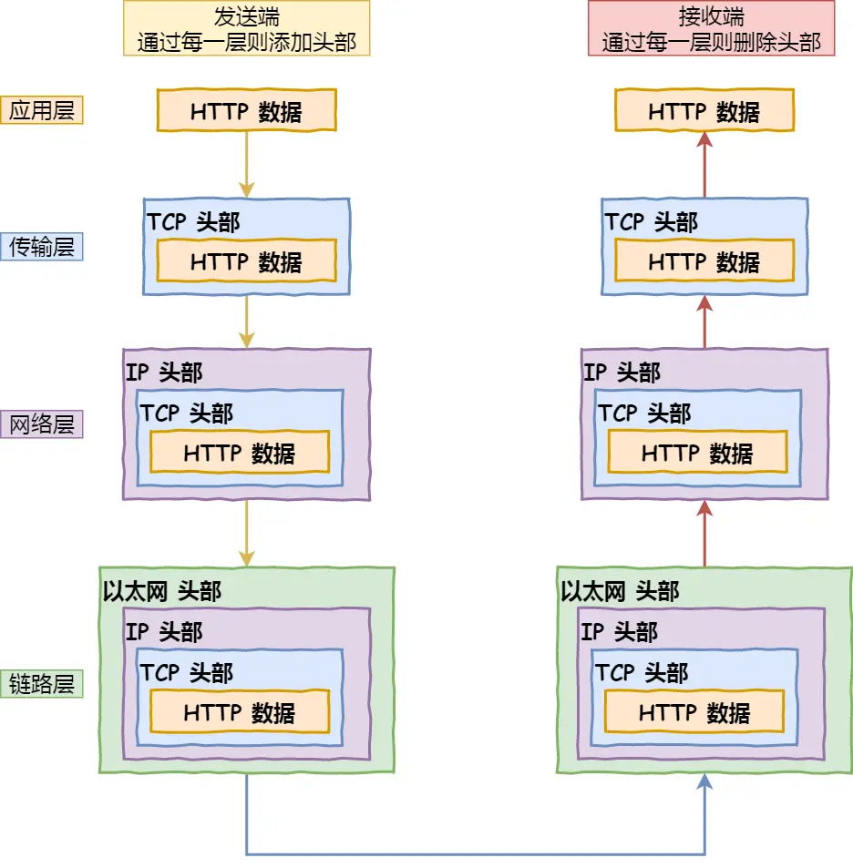
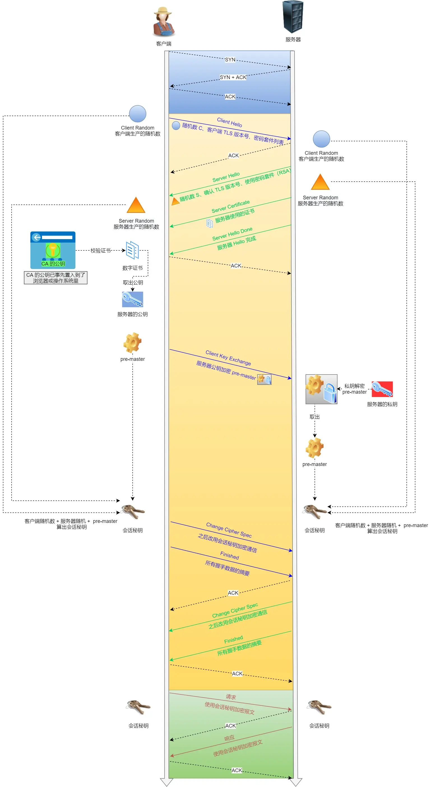
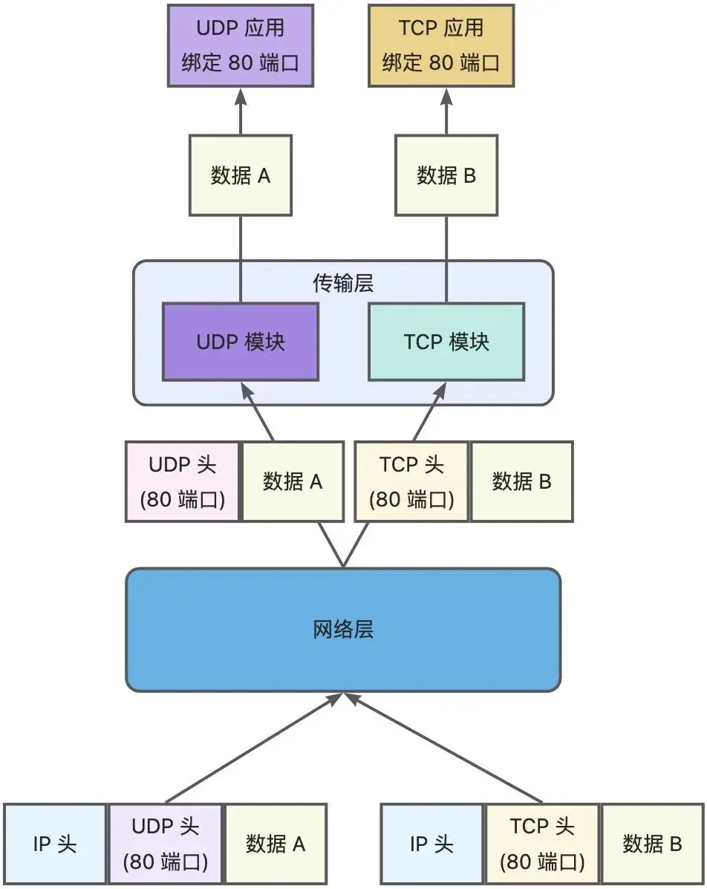
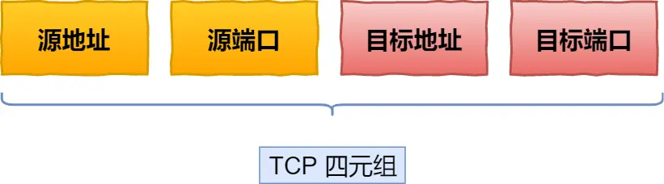

# 网络

## TCP/IP网络模型

- 应用层：为用户提供应用功能，如HTTP、FTP、DNS、SMTP等
- 传输层：为应用层提供网络服务支持：TCP、UDP协议
- 网络层：提供IP协议支持
- 网络接口层：网络层生成IP头部之后，网络接口层想IP头部增加MAC头部，并封装到数据帧发送到网络上


## 浏览器地址栏输入地址回车后发生了什么？
网络请求的流程图：


- URL地址解析：解析出域名、协议、资源路径等，生成HTTP请求消息
- DNS域名解析：向DNS服务器查询域名对应的IP（先查本地，再查远程）
- 操作系统协议栈
- 建立TCP连接：三次握手建立可靠连接
- IP模块：将数据封装成网络包
- MAC：在网络包的IP头部前面加上MAC头部（接收方和发送方的MAC地址）
- 网卡：数据出口，将二进制数据信息转换为电信号发送出去
- 交换机：将网络包原样转发到目的地，交换机工作在MAC层（二层网络设备）
- 路由器：网络包经过交换机后到达路由器，并被转发到下一个路由器或目标设备
- 数据抵达服务器后逐层解析




## TCP三次握手
客户端一发一收，服务端一收一发，客户端和服务端共经历3次确认（握手）
- 第一次：开始客户端向服务端都处于closed状态，服务端主动监听某个端口并处于Listen监听状态，客户端主动发起连接请求，发送SYN=client_isn序列号后处于SYN-SENT状态
- 第二次：服务端收到连接请求后，返回SYN=server_isn，并且ACK=client_isn+1客户端的SYN后处于SYN-RCVD状态
- 第三次：客户端收到服务端发送的SYN和ACK后，向服务端发送SYN确认的ACK==server_isn+1后处于ESTABLISHED状态


1. 为什么是三次握手，而不是四次或五次六次？（为什么三次握手才可以初始化 Socket、序列号和窗口大小并建立 TCP 连接）
   因为三次握手可以保证双方具有发送和接收能力（socket+序列号+窗口大小组合叫连接）。
   - 组织重复连接的初始化（主要因素：避免网络阻塞的重传连接建立），如果是两次连接，那么服务端socket没有一个中间状态来避免历史连接
   - 三次握手可以同步双方的初始序列号：服务器回复客户端ack和自己的序列号合并为一步，所以不需要四步。
   - 三次握手可以避免资源浪费

## HTTPS
在HTTP和TCP/IP协议之间增加一层SSL/TLS协议：
- 客户端向服务器索要并验证服务器的公钥
- 双方协商生成 **会话秘钥**
- 双方采用 会话密钥进行加密通信

基于RSA算法的TLS握手过程：
首先HTTP三次握手建立连接，然后
- 客户端与服务器第一次握手：
    - 发送客户端支持的TLS版本号
    - 发送客户端生成随机数（用于生成会话秘钥）条件之一
    - 发送客户端支持的密码套件列表，如RSA加密算法
- 服务端回复客户端
    - 确认TLS版本号，如果浏览器不支持则关闭加密通信
    - 服务器生成随机数，用于后面的会话秘钥条件
    - 确认密码套件，如RSA算法
    - 告诉客户端服务器使用的证书
- 客户端回应服务端
    - 客户端收到服务端的证书信息后通过浏览器或操作系统中的CA公钥确认服务器数字证书的有效性，如果有效则从证书中获取服务器的公钥，然后使用它加密报文，向服务器发送信息
      - 一个随机数，被服务器公钥加密（服务器和客户端都是同一个）
      - 加密通信算法改变通知，告知服务器随后的信息使用会话密钥加密通信
      - 客户端握手结束通知，同时把之前所有内容发生的数据做个摘要，给服务器做校验
- 服务器最后回应
    - 服务器收到客户端的第三个随机数pre-master-key后，通过协商加密算法计算出本次通信的会话秘钥，然后向客户端发送最后的消息：
      - 加密通信算法改变通知，表示随后的信息都将使用会话秘钥加密通信
      - 服务器握手结束通知，同时把之前所有内容的发送数据做个摘要，供客户端校验。之后整个TLS握手结束，后面的通信就是使用HTTP协议，把要发送的数据用最后生成的会话秘钥加密后发送



## HTTP1.1 HTTPS HTTP2


### HTTP2相对于HTTP1.1：
优势：
- 头部压缩：服务器和客户端同时维护一张头信息表，建立一个索引号，减少相同头的发送
- 二进制格式：报文采用二进制
- 并发传输：多个stream服用一条tcp连接
- 服务器主动推送资源
缺点：
- 队头阻塞：当前一个数据未到达时，后续先到达的只能放在内核缓冲区中等待

### TCP三次握手图


执行命令：
```shell
# 查看全连接队列
ss -lnt

## 查看是否有溢出
netstat -s | grep overflowed

# 查看半连接队列
netstat -nt | grep -i '127.0.0.1:80' | grep -i 'SYN_RECV' | wc -l
```
#### 半连接队列
服务端收到第一次握手后，将socket加入这个队列中，这个队列中的socket都是处于SYN_RECV状态。数据结构是hash表
- 为什么设计成hash表？
   因为半连接队列中的socket是未完成三次握手的，后续握手需要用到，hash表的查询时间复杂度为O(1)，效率高


#### 全连接队列
完成了TCP三次握手的socket，会从半连接队列中取出并放入该队列，这个队列中的socket的状态都是ESTABLISHED，这里面的队列就等待服务器执行accept()后，从队列中取出。数据结构是链表。
- 为什么设计成链表？
  这里的socket状态固定，不会改变，用于后续的accept()执行取出，是有序，只需要队头取出就行。


## 问题
1. TCP和UDP协议可以绑定同一个端口吗？
   可以。因为TCP和UDP传输协议在内核中是两个完全独立的软件模块，使用那个协议是由IP头信息中的协议号决定的，
2. TCP四元组组成？
   有源IP+源端口号+目标IP+目标端口号组成
3. 服务端中同一个端口号可以被两个不同的服务同时绑定吗？
   可以，因为在一端TCP唯一确定有IP和端口号一起决定，只要绑定的端口号对应绑定的IP地址不是同一个且不被包含即可。
4. TCP的socket连接流程？
   bind绑定端口和IP


5. 全连接队列和半连接队列分别是什么结构，为什么？
   - 半连接队列：
     服务端收到第一次握手后，将socket加入这个队列中，这个队列中的socket都是处于SYN_RECV状态，结构为hash表，查询效率高O(1)时间复杂度
   - 全连接队列：
     完成了TCP三次握手的socket，会从半连接队列中取出并放入该队列，这个队列中的socket的状态都是ESTABLISHED，这里面的队列就等待服务器执行accept()后，从队列中取出，结构为链表，先进先出。

6. 使用了TCP协议就一定能保证不丢包吗？
   TCP协议的特点是：可靠、基于字节流、面向连接，它只能保证从一端的传输层到另一端的传输层不丢包，应用层丢包不保证。
7. TCP握手为什么是三次，而不是四次或两次？
   - 两次无法避免历史连接的建立，造成资源浪费
   - 四次中可以吧第二次服务端发送ack和服务端发送服务端序列号合并为一步，ack=对方的序列号+1
8. TCP四次挥手能用三次替代吗，为什么？
9.  dd