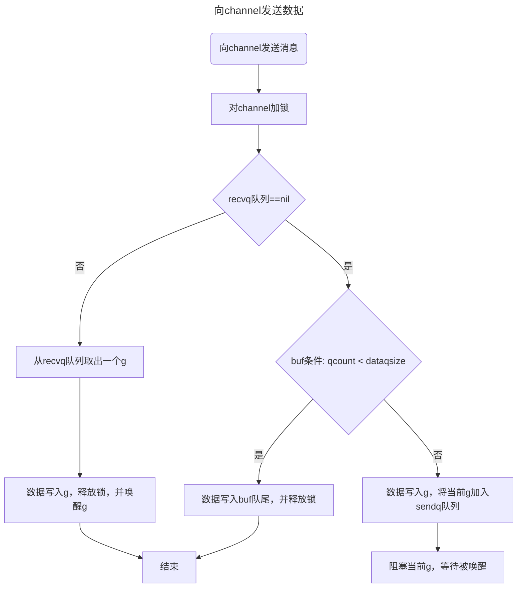
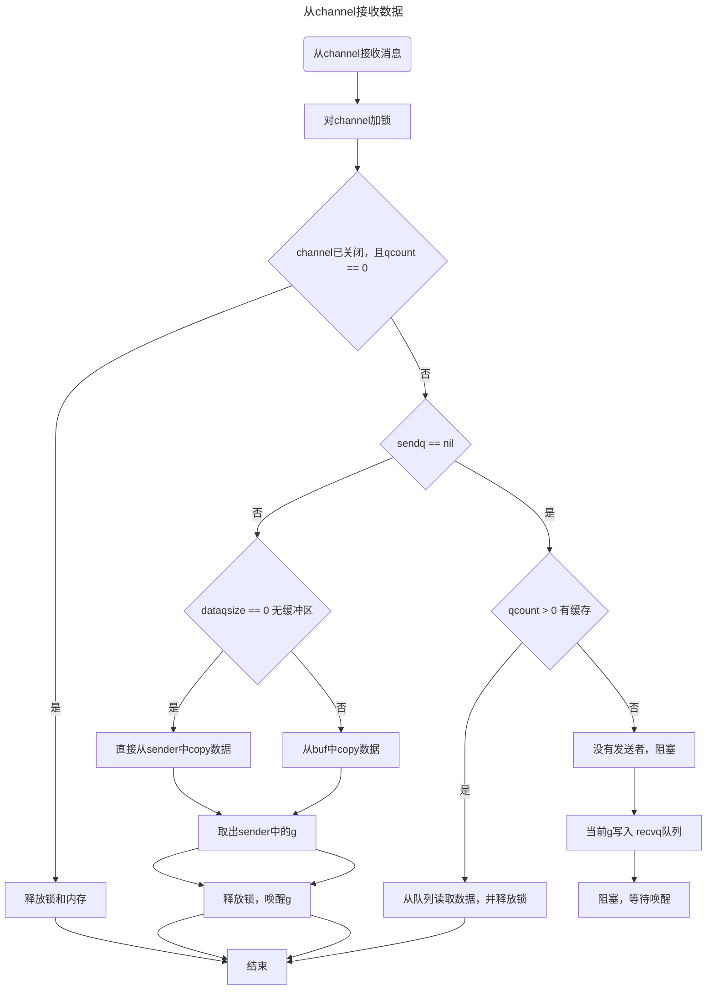

# Golang面试总结

## array 和 slice 有什么区别？
1. 结构上，array的长度不变，在内存中是一款连续的内存空间；slice是在array结构基础上实现的，包括一个执行存储数据的数组指针，长度和容量。
2. 参数传递上，array 和 slice 都是值传递，只不过，array是值的副本，slice传递的是指针值的副本。在函数中修改array一定不会修改源值，但是修改slice，如果不发生扩容是会修改源数据的值，如果发生了扩容不会修改源值。

## 对一个关闭的channel进行读和写，分别会发生什么？
写：发生panic异常
读：可以读，并且不会阻塞。如何关闭前channel缓存中还有未读的数据，那么可以读，第一个返回值是数据，第二个返回值（是否读成功）是true；如果关闭前缓存中已经没有数据了，那么第一个读取值返回类型的零值，第二个返回值为false。

## 解释一下PHP-FPM
PHP-FPM是实现FastCGI的程序，FastCGI是用来提高CGI（通用网关接口）程序性能的方法，PHP-FPM实现了FastCGI并增加了进程管理，通过master进程管理worker进程池来提高进程的利用率，降低进程的创建开销，达到提高性能的目的。

## nil切片和空切片指向的地址一样吗？为什么？
切片的数据结构是：一个指向底层数组的指针，容量，长度。nil切片是这个指针是nil，即没有分配底层数组。空切片是分配了一个长度为0的数组，内存地址不为空。nil切片没有指向地址，空切片指向固定的地址。

## 为什么需要内存对齐？
答：内存对齐是，对一个数据的地址address跟数据类型的长度sizeof做取模运算 address % sizeof(type)，如果值为0，则表示是内存对齐的，反之不对齐。主要是因为CPU读取缓存的方式决定的，内存对齐的数据，CPU取数据时可以减少CPU读取的次数，能够提高执行效率。

## 字符串转成[]byte数组，会发生内存拷贝吗？
答：字符串转成字节数组会发生内存拷贝。只要发生类型转换都会发生内存拷贝。

## 如何避免字符串转成[]byte数组时的内存拷贝？
答：可以使用unsafe.Pointer直接操作内存，避免内存拷贝，注意，string指向的内存是只读内存，因此强转后修改会报错，具体实现：
- 使用unsafe.Pointer转换字符串的地址：unsafe.Pointer(&a)
- 将unsafe.Pointer类型转为reflect.StringHeader，并取值：*(*reflect.StringHeader)(unsafe.Pointer(&a))
- 再次使用unsafe.Pointer转换为[]byte：*(*[]byte)(unsafe.Pointer(&&aa))
  示例代码：
```golang
a := "123456789"
b := *(*reflect.StringHeader)(unsafe.Pointer(&a))
c := *(*[]byte)(unsafe.Pointer(&b))
fmt.Println(c)
```

## 进程、线程、协程的区别
- 进程：进程是一个执行中的程序实例，拥有自己的地址空间，是系统进行资源分配的基本单位。不同进程通过进程通信来通信，由于占据独立的内存空间，因此在进行进程上下文切换时开销很大，且只发生在内核态，但是相对比较安全问题。
- 线程：是操作系统能够进行运算调度的最小单位，是进程的一个执行流，与进程内的其他线程共享进程的资源，上下文的切换有内核态控制。
- 协程：是轻量级的线程，创建一个协程只占用很小的资源空间，由用户自己控制切换，且上下文切换的开销比线程小

## 死锁是如何产生的？怎么避免？
产生死锁的原因：
- 系统资源不足
- 程序运行推进的顺序不合适
- 资源分配不当
产生死锁的四个必要条件：
- 互斥：资源只能被一个线程占用，其他的必须等待。
- 请求保持：需要请求新的资源，但是对已占用的资源又不释放
- 不可剥夺：线程已获得的资源，在未使用完毕之前，不能被其他线程剥夺，只能在使用完毕有由自己释放
- 循环等待：互相等待对方释放资源，形成等待死循环。
如何避免死锁？
- 破坏互斥条件：系统例取消互斥，若资源一般不被一个进程独立占用，那么忙私有是肯定不会发生的，但一般互斥条件是无法破坏的，因此，在死锁预防里主要是破坏其他三个必要条件，而不去设计破坏互斥条件
- 破坏请求和保持条件：
  - 1. 在进程开始运行之前，一次性申请其在整个运行过程各种所需要的全部资源
  - 2. 改进方案1，进程启动时，允许进程只获得运行初期需要的资源，在运行过程中逐渐释放掉已经使用完毕的资源，然后再去请求新的资源。
- 破坏不剥夺条件：当一个已经持有了一些资源的进程在提出新的资源请求没有得到满足时，他必须释放已经保持的所有资源，待以后需要使用的时候再重新申请。即允许进程已占用的资源被短暂的释放或抢占
- 破坏循环等待条件：可以通过定义资源类型的线性顺序来预防，可以将每一个资源编号，当一个进程占有编号的资源时，那么它下一次申请的资源只能大于当前编号的资源。即有序申请资源

## go中类型断言发生了内存拷贝吗？
- 接口转接口时未发生内存拷贝，直接赋值（接口转换时接口本身的数据不能被改变）
- 数据类型转接口发生了内存拷贝（数据类型转换的接口可能发生数据改变，为了避免改变接口数据，重新分配了内存并拷贝原来的数据）

## 反转含有中文、数字、字母的字符串
```golang
a := "大丰收的123dfd个二哥"
s := []rune(a)
for i,j := 0, len(s)-1; i < j; i, j = i+1, j-1 {
    s[i], s[j] = s[j], s[i]
}
v := string(s)
```

## 拷贝大切片一定比小切片代价大吗？
切片的底层结构伪代码是：
```golang
type Slice struct {
    data uintptr
    len int
    cap int
}
```
其中data是指向底层数组的指针的值，拷贝切片时实际值拷贝了data,len和cap这三个字段值，并不会拷贝底层的数组。

## json包变量不加tag会怎么样？
对公开属性不加tag，json后会使用属性名称作为key；对私有属性加不加tag，都不会序列化到json字符串中。示例：
```golang
type Data struct {
	Name string `json:"name"`
	Id   int
	age  int `json:"age"`
	url  string
}

func main() {
	v := Data{
		Name: "ddd",
		Id:   1,
		age:  10,
		url:  "http://sss",
	}

	b, _ := json.Marshal(v)
	fmt.Println(string(b))
}
// 输出：
// {"name":"ddd","Id":1}

```

## reflect（反射包）如何获取字段tag​？为什么json包不能导出私有变量的tag？
1. reflect 通过 reflect.TypeOf(x) 或者 reflect.TypeOf(&x).Elem() 获取类型信息，然后遍历res.Field(index).Tag.Get("json")来获取对应tag字段，伪代码示例：
```golang
type x struct {
    name string `json:"name"`
    age int `json:"age"`
}
t := reflect.TypeOf(x) 
// 或者 t := reflect.TypeOf(&x).Elem()
for i:=0;i<t.NumField();i++{
    fmt.Println(t.Field(i).Tag.Get("json"))
}

```
2. json包不能到处私有属性是因为到处时过滤掉了非导出的属性

## map不初始化使用会怎么样？
会直接panic，因为map的零值是nil，向nil map分配实例会报panic。但是对nil map进行查询和删除是不报错的。

## map不初始化长度和初始化长度的区别？map是如何扩容的？
map扩容分为两种，增量扩容和等量扩容
- 增量扩容：count数量太多了，具体条件：count > 8 && count > 6.5 *（1 << (B & 63)）= 6.5 * 2^B
- 等量扩容：溢出桶overbucktets太多了（先向map大量加入键，然后再删除，造成生成了太多的溢出桶），具体条件：noverflow >= 1<< (B&15) = 1 << B（B>15后设置B=15）= 2^15


## go的并发模型有哪些？是如何实现的？
- 基于共享内存：互斥锁、读写锁
- 基于channel的协程间同学：协程间通信同步数据

## Go的互斥锁sync.Mutex、sync.RWMutex实现原理？
- sync.Mutex结构包括锁状态和阻塞/唤醒信号量(用于唤醒抢锁阻塞等待的g)， 使用原子比较交换实现
- sync.RWMutex是在互斥锁的基础上实现的，对互斥锁增加写入器，读取器计数器和写入和读取信号量，用于阻塞和唤醒g实现的。

### 互斥锁的饥饿模式：
新请求锁的协程g，不会进行锁获取，直接进入等待队列的尾部阻塞等待获取锁。
- 触发条件：
  - 一个协程g获取锁的时间超过了1ms，互斥锁会切换到饥饿模式
- 饥饿模式取消条件：
  - 获取到锁的这个协程g的等待时间在1ms以内，互斥锁会切换到正常模式
  - 获取到锁的这个协程g是等待队列的最后一个时，互斥锁会切换到正常模式


## map遍历中删除，影响遍历吗？如果频繁插入有删除会造成什么？
遍历中删除不影响遍历本身。大量插入删除会触发等量扩容，最终可能会触发内存泄漏，因为一直插入删除，溢出桶会越来越大，最终耗尽内存。
map的delete删除只是叫tophash为对应key进行empty标记，并没有清空内存中的数据。可以使用 map = nil 来清空，等待gc自动回收。

## 字符串不能改,那转成数组能改吗,怎么改？
如果是强制转换如[]byte(xx)，那么可以对转后的可以改。因为类型强制转换一定会触发内存拷贝，此时的字符串底层字节数组是元数据的副本，且切片的内存数据允许修改。

## 怎么判断一个数组是否已经排序？
- 如果这个数组的类型已经实现了sort排序接口，那么可以直接调用sort.IsSorted(x)判断是否已经排过序
- 如果没有实现，那就自己实现一个判断数组是否有序的方法

## map遍历为什么是无序的？
因为map迭代器初始化时，生成其实查询地址时使用了fastrand()，每一次重新range迭代初始化都会重新随机选择一个桶作为遍历起点。

## Golang 中指针运算有哪些？
golang中指针不支持运算，不过可以使用unsafe.Pointer和uintptr转换后进行指针运算。

## for select 一个已经关闭的通道会怎么样？如果select中只有一个case呢？
- 如果有多个case，那么会一直执行被关闭的这个case
- 如果只有一个case，那么会一直执行这个case，并进入死循环中

## 从一个nil channel中读取数据会发生什么？
会阻塞并触发deadlock。当协程发生阻塞，但是无法接触阻塞状态时就会触发死锁
- 向nil通道发送，阻塞
- 从nil通道接收，阻塞
- 向无缓存通道发送，阻塞
- 从无缓存通道接收，阻塞
- 向有缓存未满通道发生，发送成功
- 从有缓存未满通道接收，接收成功
- 向已满有缓存通道发送，阻塞
- 从已满有缓存通道接收，接收成功
- 向已关闭通道写，panic
- 从已关闭通道接收，有缓存读缓存，无缓存读的结果为类型零值
- 关闭一个nil通道，panic

## channel的实现原理？
先看channel的底层结构：
```golang
type hchan struct {
    qcount uint // 环形队列缓存中的剩余数据个数
    dataqsize uint // 环形队列的长度，最大可以缓存多少个数据，对应make的size
    buf unsafe.Pointer // 环形队列指针
    elemsize uint16 // 每个元素大小，用于在buf中定为元素位置
    closed uint32 //  标识通道关闭状态
    elemtype *_type // 元素类型，用于数据传递过程中的赋值
    sendx uint // 队列的索引下标，指示元素写入队列时存放在队列中的下标位置
    recvx uint // 队列的索引下标，指示元素从该队列读出的位置
    sendq // 等待写消息的写成g队列
    recvq // 等待读取消息的g队列
    lock mutex // 互斥锁，chan不允许并发读写，一个channel只允许同时被一个协程读写
}

```
### channel发送消息流程示意图：


### 从channel接收数据


## 三色并发
- 黑色：已扫描完成，存着引用的对象
- 灰色：正在扫描的对象
- 白色：未扫描到的垃圾

### 强三色
黑色和白色之间不直达，白色不能直接关联黑色
### 弱三色
白色路径上一定存在至少一个灰色，白色可以直接关联黑色

### 插入屏障
A对象引用B对象时，将B对象标记灰色，只作用于堆对象，保证堆对象扫描不需要STW，但是结束时需要栈扫描需要STW。强三色
```
添加下游对象(当前下游对象slot, 新下游对象ptr) {   
  //1
  标记灰色(新下游对象ptr)   

  //2
  当前下游对象slot = 新下游对象ptr                   
}
```

### 删除屏障
如果被删除的对象A，自身是白色或灰色，则标记为灰色，开始时需要STW保护栈和堆对象，结束时不需要STW，但是扫描粒度低，部分垃圾对象需要下次GC扫描才能释放。弱三色
```
添加下游对象(当前下游对象slot， 新下游对象ptr) {
  //1
  if (当前下游对象slot是灰色 || 当前下游对象slot是白色) {
        标记灰色(当前下游对象slot)     //slot为被删除对象， 标记为灰色
  }

  //2
  当前下游对象slot = 新下游对象ptr
}
```

### 混合屏障
>> 注意混合写屏障是Gc的一种屏障机制，所以只是当程序执行GC的时候，才会触发这种机制。
满足弱三色不变
- GC将栈上的对象全部扫描，并标记根部可达对象为黑色（之后不在进行第二次扫描，无需再次STW，**标记过**程彻底告别STW）
- GC期间，任何在栈上创建的对象都是黑色
- 被删除的对象标记为灰色
- 被添加的对象标记为灰色
```
添加下游对象(当前下游对象slot, 新下游对象ptr) {
    //1 
        标记灰色(当前下游对象slot)    //只要当前下游对象被移走，就标记灰色

    //2 
    标记灰色(新下游对象ptr)

    //3
    当前下游对象slot = 新下游对象ptr
}
```


### 优缺点
- 插入写屏障：结束时需要STW来重新扫描栈，标记栈上引用的白色对象的存活；
- 删除写屏障：回收精度低，GC开始时STW扫描堆栈来记录初始快照，这个过程会保护开始时刻的所有存活对象。
- 混合写屏障：未解决回收精度低问题，但是解决了栈扫描STW问题，避免的二次扫描的STW（栈空间不启动，堆空间启动，无STW）。

## GC触发时机
- 堆内存分配是少一次的一倍时触发
- 定时触发
- 手动触发runtime.GC()

## GC优化？
- 避免大量创建go程
- 降低并服用已经申请的内存，如使用sync.Pool对象池等
- 跳转GOGC，让触发GC的时间变长

## GC流程当前？
- off：GC禁用，开启屏障
- stack scan：栈扫描，全黑标记
- mark：扫描所有根对象和可达对象，并标记它们。
- mark termination：完成标记，重新扫描根对象（STW），关闭屏障和辅助GC
- sweep：按标记清除白色对象
- off

# 加密
- 对称加解密：加解密使用同一对秘钥，如AES，DES
- 非对称加解密：加解密使用不同的秘钥，如RSA
- 签名算法：md5,sha1,hmac
## AES 和 DES加密
AES是一个对称分组密码算法，加密过程是：字节替代->行位移->列混淆->轮密钥加。解密是逆序执行。

DES是一种对称加密算法，DES加密时以64位分组对数据进行加密,加密和解密都使用的是同一个长度为64位的密钥,实际上只用到了其中的56位,密钥中的第8,16…64位用来作奇偶校验

## 权限实现
- user：用户表
- role：角色表
- menu：菜单表
- permission：权限表，包含菜单ID：meun_id，抽象用户权限实体：查看、编辑、删除
- api：资源表
- user_role：角色权限关系表
- role_permission_id：角色权限关系表
- permission_api：权限资源关系表

user->role->role_permission->permission_api->menu