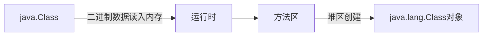

# Java基础

## 一个.java源文件中是否可以包含多个类？有什么限制？
可以包含多个类，但是只能有一个公开类，且该公开类名和文件名必须一样。

## java中有没有goto？
goto是java的保留关键字

## & 和 &&的区别
&：与运算符，左右两边参与与运算
&&：且，只有前面的条件为真时，才会执行&&后面的语句

## 在java中如何跳出多重嵌套的循环？
- 在循环外部定义虚幻标签，如 table:，在需要跳出的循环内部使用break 标签名，即可跳出当前多重嵌套循环。
- 在需要跳出循环的内部使用标记变量，在外层循环条件中判断该标记跳出或结束循环

## switch 能否接收一个byte或者int或者string类型的参数？
可以是byte,int变量，也可以是string，如果是string，那么case必须接受一个常量字符串。

---------------------------------
# 面试题
## 什么是类的加载？
将类的.class文件中的二进制数据读入到内存中，将其放入在运行时数据区的方法区内，然后在堆区创建一个java.lang.Class对象。Class对象封装了类在方法区内的数据结构。

## 类的加载过程？各个过程分别做什么？
过程如下：

- Loading加载：将Class的二进制数据加载到方法区中，并在堆区生成java.lang.Class对象，作为多方法区中这些数据的访问入口。
- Verification验证：确保被加载的类的正确性：
  - 文件格式验证
  - 元数据验证
  - 字节码验证
  - 符号引用验证
- Preparation准备：在方法区中为类的**静态变量**分配内存，并初始化为默认值。注意：
  - 准备阶段分配的变量仅包括 static 类变量 
  - 初始化的值是类型零值，不是代码中指定的值。如果该 static 变量被 final 修饰了，那么准备阶段初始化值为代码中赋值的值。static int value = 3; value准备阶段初始化为0；如果为 final static int value = 3；value准备阶段初始化为3。
- Resolution解析：把类中的符号引用转换为直接引用。直接引用：直接指向目标的指针、相对偏移量、一个间接定位到目标的句柄。
- Initialization初始化：为类的static变量赋值（代码中指定的值）：
  - static 指定的值，如 static int value = 3;
  - static 静态代码块，如 static {}

## JVM初始化步骤？
- 类还没有被加载和连接，则先加载并连接该类
- 类的直接父类还没有被初始化，则先初始化其直接父类
- 类中有初始化语句，则系统依次执行这些初始化语句

## 类的初始化时机？
当类被主动使用的时候才会触发类的初始化：
- 对类的静态变量的访问或者赋值
- 调用类的静态方法
- 创建类的实例：new ClassA
- 反射
- 初始化某个子类，会触发其父类的初始化
- java虚拟机启动时被标明启动类的类（Java Test），或者直接使用 java.exe命令执行某个主类。

## java虚拟机结束生命周期的时机？
- 执行System.exit()方法
- 程序正常执行结束
- 程序异常终止
- 操作系统出现错误导致java虚拟机进程终止

## 类的生命周期
