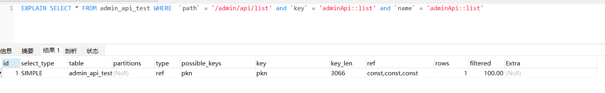
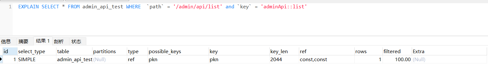
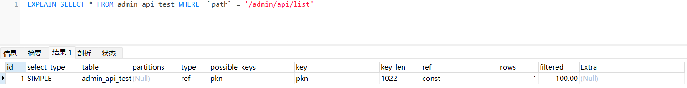
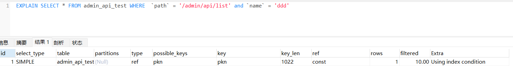
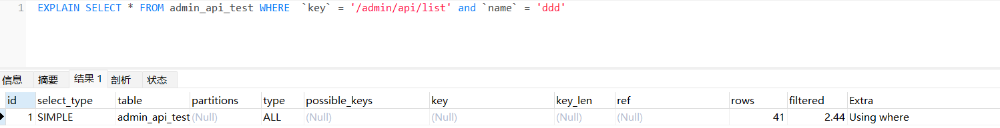
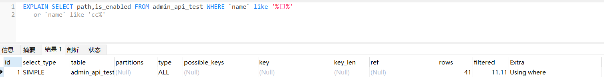
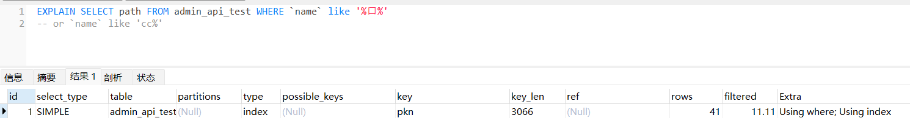

# MySQL面试总结

## 以MySQL为例，如何对SQL进行优化？
- 开启慢查询
- 对SQL执行explain执行计划，查看分析结果
- 建立适当的索引：主键索引、二级索引（辅助索引）、前缀索引、联合索引、唯一键索引等
- 写SQL是避免索引失效：最左匹配原则

## MySQL发生了死锁怎么办？
插入意向锁和间隙锁不兼容，间隙锁和间隙锁兼容
- 快照读：普通select语句（mvcc）
- 当前读：select ... for update 语句(加记录锁+间隙锁)
死锁发生的场景：
1. 事务A：select id from user where id = 1 for update; 加排他锁（间隙锁+记录锁）
2. 事务B：select id from user where id = 4 for update; 加排他锁（间隙锁+记录锁）
3. 事务A：insert into user (`id`) values (2); 插入意向锁（记录不存着排它锁变成间隙锁）
4. 事务B：insert into user (`id`) values (6); 插入意向锁（间隙锁已存在是，新的插入会先获取插入意向锁）
事务A和B的第一步都开启了next-lock间隙锁，第二步要获取插入意向锁，事务A等待事务B释放间隙锁，事务B等待事务A释放间隙锁，造成循环等待死锁（循环等待(死循环)，请求保持(占有资源不放)、互斥(只能被一个人占有)、不可剥夺(自己释放)）

## MySQL的主键使用顺序和乱序有什么影响？为什么？
乱序写入会造成：
- 乱序ID，会造成写入的数据不在页缓冲区，那么插入的时候会先从磁盘读取目标页到内存，从而导致到了的随机I/O，影响性能和浪费内存空间。如果是有序写入，一般在相同的内存页中，或者下一个内存页中，相对于乱序会生成很少的内存页占用，少量磁盘I/O。
- 可能会造成大量的页分裂，每页16kb，页越多占用的空间越大，且页分裂会造成数据移动，页面变得稀疏，导致数据碎片化。

### 解决乱序主键页分离、数据碎片化、内存占用问题？
使用 optimize table 语句重建表并优化页填充可以优化随机乱序ID的影响。

### optimize table原理
把分散存储的数据放在一块，清除碎片，回收闲置的数据库空间。

#### 使用场景
- 乱序主键写入，造成的内存页分散，大量随机I/O，及数据碎片化问题
- 频繁的插入和删除数据，造成的磁盘空间（数据空间、索引位）的没有被收回

## MySQL事务的隔离级别？
- 读未提交：事务修改数据未commit，允许其他事务读取：脏读(读到了别人修改的数据)、不可重复读(前后读取的数据不一致)、幻读（前后数据量不一致）
- 读已提交：事务修改数据，只有commit了的，才允许被其他事务读取，每个select生成read view快照
- 可重复读：事务执行中看到的数据跟事务开始执行时保持一致，快照读（普通select，不加锁），当前读（select for update，加next-key lock ），每次事务开启时生成read view，事务中使用这个快照。
- 串行化：事务排队

## MySQL事务的特性：
- 原子性：通过回滚日志 undo.log保证
- 持久性：通过重做日志 redo.log保证
- 隔离性：通过mvcc（快照读）或加锁保证（当前读）
- 一致性：通过原子性、持久性、隔离性一起保证

## Read View
Read View的四个字段：
- creator_trx_id：创建这个Read View的事务的ID
- max_trx_id：下一个要创建的事务的ID，当前系统中最多的事务ID+1
- m_ids：创建read view时，当前数据库中已经创建且未commit的活跃事务id列表
- min_trx_id：m_ids中最小的事务ID
聚簇索引的行的隐藏列：
- trx_id：事务ID
- roll_pointer：旧版本在undo.log中的记录指针，版本记录指的是undo.log中的数据
通过判断当前事务和min、max事务ID的大小，得出当前记录对该事务的可见性，这个就是MVCC多版本并发控制。


## MySQL如何查看索引信息？如何做索引优化？
- 查看索引信息：
使用show index from 表名 from 数据库名，查看表中的索引情况。
```sql
show index from tablename from dbname;
```
- 索引优化：
1. 适合索引的列是出现在where子句中的列，或者连接子句中指定的列。
2. 基数较小的列，索引效果较差，没有必要为此列创建索引
3. 使用短索引，如果对长字符串列进行索引，应该指定一个前缀长度，这样可以节省大量索引空间
4. 不要过度索引。索引需要额外的磁盘空间，并降低写操作的性能。在修改表内容的时候，索引会进行更新甚至重构，索引列越多，这个时间越长。所以只保持需要的索引有利于查询即可。
基数：单个列唯一键的数量叫做基数。

## 如何查看MySQL的内存使用情况？
查询系统的performance_schema库中memory相关的表

## 数据库表如何分库分表
- 垂直分表：按照业务，将业务关系紧密的放在一张表中（读业务大）
- 水平分表：按照一些字段进行hash或按段分表（数据量大时水平分表）

## MySQL索引优化的方法？
- 字段使用合适的数据类型（避免空间浪费）
- 避免使用select * from查询所有列（需要查询主键索引，可能需要回表）
- where条件中建立合适的索引，是查询尽量使用到索引，尽量做到使用覆盖索引
- 使用explain或者show index from table分析SQL和分析索引情况
- 定期优化数据库表：optimize table

## 索引使用情况
### 联合索引（a,b,c）
- abc
```sql
EXPLAIN select * from table where a = 1 and b = 2 and c = 3;
```
使用索引情况：使用了联合索引，ref：const,const,const

使用了联合索引，const,const,const
- ab
```sql
EXPLAIN select * from table where a = 1 and b = 2;
```

使用了联合索引，const,const
- a
```sql
EXPLAIN select * from table where a = 1;
```

使用了联合索引，const
- ac
```sql
EXPLAIN select * from table where a = 1 and c = 3;
```

使用了联合索引，且用到了索引下推（using index condition）

- bc
```sql
EXPLAIN select * from table where b = 2 and c = 3;
```

索引失效


- c
```sql
EXPLAIN select * from table where c = 3;
```

索引失效

- null：最优，不需要额外处理
- using index：使用索引覆盖，不会回表
- using where：使用索引，但是需要回表查询
- using index condition：使用了索引，但是使用了索引下推
- using where;using index：使用了索引，且列都在索引中
- using MMR：使用顺序磁盘读取策略

## mysql or索引会失效吗？
不一定。如果or条件的前后字段都是索引字段（如果后一个时联合索引字段那么必须满足最左匹配原则），则会使用索引，且会使用索引下推。需要根据第一个条件字段是否是索引字段决定是否会使用索引。

## count(*)和count(1)有区别吗？为什么？
没有区别，count是统计不为null的数量，count(*) = count(0) = count(1)，而0和1都不为NULL。mysql会将count(*)的*转换为0统计。
count(*) = count(1) > count(id) > count(其他字段)。
count(id)会走主键索引，统计id!=NULL的数量，需要遍历索引。count(其他字段)如果未建立索引，需要全表扫描（是否使用索引）。

# mysql field like '%keyword%'索引会失效吗？
不一定。
- 查询的字段全部在索引中时，会使用索引
- 查询的字段中包括没有创建的索引列时，索引会失效

# MySQL如何避免全文扫描？
EXPLAIN执行SQL后Type=All，通常在以下情况下发生：
- 表中的数据行很少，通常少于10行（此时全表扫描更快）
- SQL语句缺少WHERE或ON条件
- 正在使用索引和常量值比较，并且mysql计算出的基于索引数的常量覆盖了表的很大一部分，且表扫描会更快
- 正在通过另一列使用基数很低的键，这种情况下，mysql会假定使用这个键可能会需要很多的键查找，且全表扫描更快
使用以下方式可以避免全表扫描：
- 使用 ANALYZE TABLE table_name 更新扫描表的键分布
- 使用 FORCE INDEX (index_column) 来强制使用索引：select * from t1,t2 FORCE INDEX (index_column) WHERE t1.col_name = t2.col_name
- SET max_seeks_for_key=1000告诉优化器键扫描不超过1000

# MySQL索引失效的情况？
对查询的字段中包含不在索引中的字段时，以下场景会触发索引失效：
- 联合索引失效：查询的列无法优化构成最左前缀，则无法使用联合索引。
- 单列索引失效：
  - 对索引字段计算：where id + 1 = 10，因为索引存储的是字段的原始值。
  - 对索引字段使用函数：where length(id) = 10，因为索引存储的是字段的原始值。
  - 使用 where field like '%xx%'，'%x'
  - 索引字段进行了隐式转换，如 name = '10'使用了索引，但是name = 10就无法使用索引了。
  - 使用 where field1 = 1 or field2 = 2
  - 使用or前的列是索引列，or后的列不是索引列


# MySQL如何优化sql？
- 定位慢查询的SQL：通过慢查询日志或相关工具，执行SQL查看慢查询日志是否开启：
```sql
show variables like 'slow_query_log';
- 临时修改，mysql重启后失效，要永久有效需要更改mysql配置，在mysqld的配置中增加slow_query_log=ON;
set global slow_query_log=on;
```
- 对慢查询SQL执行EXPLAIN，查看使用索引情况。
对需要增加索引的增加按照索引创建的原则创建或修改。

# 建立索引的原则？
1. 避免索引失效（未使用）
2. 避免索引过多（重复）
3. 避免索引臃肿（索引字段长，尽量使用前缀索引）

- 对查询多的字段创建合适的索引，如单列索引，联合索引；但是在创建联合索引时需要保证查找的最左匹配原则（联合索引的第一个列字段，一定要出现在查询条件中）
- 少于10行数据的表不需要建立索引（全表扫描更快）
- 建立的索引字段不能参与函数计算和类型的隐式转换（会失效）
- 尽量扩展索引，避免新建索引。（索引多了会影响写入、删除、修改操作）
- 不要对区分度低的字段建立索引

# MySQL如何优化索引？
- 前缀索引优化：只取字段的前部分建立索引，减小索引的大小，可以增加一个索引页中存储的索引值
- 覆盖索引优化：查询的字段都是该索引上的字段，不用回表查询主键索引获取行数据。
- 主键索引最好是自增：
- 防止索引失效

# redis分配集群
  对key进行crc16(循环冗余校验)校验后，进行hash，对hash结果按照16383进行取模，余数在当前槽点管理的范围内则返回对应的数据，如果不在槽点内则返回数据所在的节点给到客户端，客户端再去对应的节点获取数据。


# 负载均衡的算法
- 轮询法：将请求轮流分配到后端的节点上，不关心各个节点的负载使用情况和实际连接数
- 随机法：将请求随机分配到后端的节点上，不关心各个节点的负载使用情况和实际连接数。随着请求的增多，请结果类似轮询。
- 原地址哈希算法：将客户端的IP地址，通过哈希计算得到一个数值，然后对服务端节点数进行取模，取模的结果就是要访问的节点。优点是：同一个ip地址的客户端请求都会落到同一个节点上。缺点：可能会造成不均衡访问问题，使个别节点的负载和连接数异常的高，个别节点又太空闲。
- 加权轮询法：对节点分配一个权重值，通过权重值影响某个节点的访问概率
- 加权随机法：对节点分配一个权重值，通过权重值影响随机到某一个节点的概率
- 最小连接数法：根据每个节点的当前的连接数排序，选择连接数最小的节点访问。
- P2C算法：从后端节点中通过随机或其他策略选出两个节点node1,node2，比较两个节点的负载连接情况，选出一个负载最小的。

# nginx的负载均衡策略
- 加权轮询法
- ip_hash法
- 其他第三方如url_hash等

# 限流算法

## 计数器算法(单机可用)
设置一个时间范围内的访问次数上限，达到后限流。缺点无法解决临界和突发问题（突刺问题，前面的10s中把请求用完了，后面50s干瞪眼）。
### 实现
- 计数器
- 开始时间标记

## 漏斗桶算法(单机可用)
为了解决计数器限流法的突刺问题，引入漏斗桶算法。即将请求按续放入桶中（队列尾部），然后在队列的开头匀速取出，这样保证了处理请求的速率稳定，当请求数超过桶的容量（队列容量）时，把新请求拒绝丢弃掉，已达到稳定限流目的。但是该算法无法解决短时间的突发流量问题
### 实现
- 队列
- 设置队列的消费速率

## 令牌桶算法(单机可用)
创建一个桶，往这个桶里面按照一定的速率放入令牌，请求来时，先从桶中取令牌，取不到令牌则拒绝请求已达到在一定的时间范围内，对超出负载的请求进行拦截限流的目的。可以保证令牌桶中按照一定的速率始终是有可用的令牌的，依次可以在一定程度上解决突发流量问题，因为突发流量来了后。

### 实现
- 队列（桶）
- 令牌生成器，按照一定的速率往队列中加入令牌

## 集群限流（多机可用）
### 使用场景
限制每个用户的访问次数和频率

### 实现
在redis中对每个访问的用户设置一个有过期时间的key，每次访问后key的值自增1，已达到现在用户在一定时间内的访问次数。

