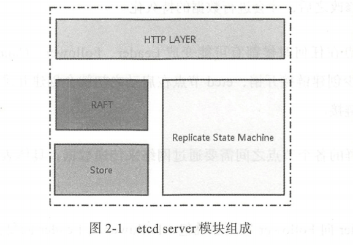
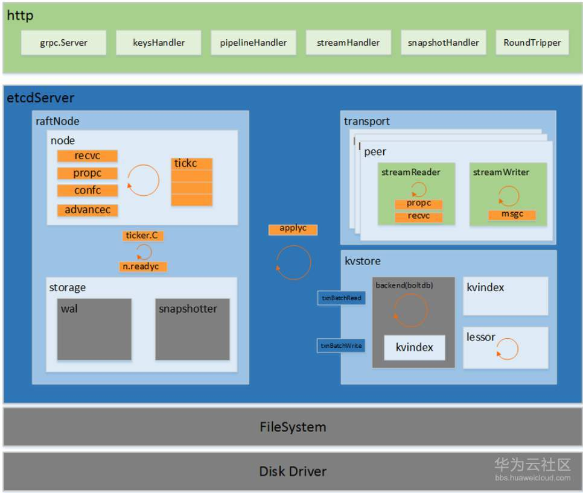

# Etcd
是一个分布式的、一致性的键值存储组件。主要分为四个部分：
- http layer：提供网络数据读写功能，监听服务端口，完成集群节点之间数据通信，收发客户端数据。
- raft：强一致性算法raft的实现，保证数据的一致性
- store：涉及kv(key-value)、wal（write ahead log）、snapshot（快照），用户处理etcd支持的各类功能的事务，包括数据索引、节点状态变更、监控与反馈、事件处理和执行。是etcd提供的大多数api的具体实现
- replicate state machine：复制状态机，这是一个抽象模块，状态机的数据存储在内存中，定期持久化到磁盘，每次写请求都会持久化到wal文件，并根据写请求的内容修改状态机数据。
## wal（write ahead log）预写式日志：是etcd数据存储的方式。etcd通过wal进行持久化存储，所有数据都会提前写入日志。其中snapshot（快照）是为了防止状态数据过多而进行的快照，Entry是存储的具体日志数据。

## Etcd的架构图

在etcd 的实现中， 根据不同的用途，定义了各种不同的消息类型些不同的消息，最终都将通过 protocol buffer 格式进行编码。
大消息如传输 Snapshot 的数据 就比较大，甚至会超过1GB ，而小消息则如 Leader Follower 节点之间的心跳消息可能只有几十 KB。
etcd 在实现中，对这些消息采取了分类处理的方式，它抽象出了两种类型的消息传输通道，即 Stream类型通道和 Pipeline 类型通道。
- Stream: 用于处理数据量较少的消息,例如心跳、日志追加消息等。点到点之间维护一个HTTP长连接。 Pipeline:用于处理数据量大的消息，如Snapshot。不维护长连接。 Snapshot这种数据量大的消息必须和心跳分开传，否则会阻塞心跳消息。
- Pipeline也能用于传小消息前提是Stream不能用了。

## Etcd如何保证数据一致性的？
使用raft一致性算法保证数据一致，数据流向：leader->follower，包括两个过程
- 选主过程：给自己投票+请求其他节点给自己投票，先到的请求且版本号不大于自己的投票成功，当获得的票数超过一半时当选leader，其他节点变成follower
- 主从同步过程

## Etcd主从同步的过程
- client连接到节点，如果是从节点写，从节点会把写请求转发给leader节点，如果是读请求，则从节点也可以自己处理。
- leader收到写请求后，先将请求预写入log（entry），得到在日志中的index索引号，然后将批量的entry日志发送给所有的从节点
- 从节点接收到leader的appendEntryRPC请求后，会将批量传过来的entry写入到自己的日志中（不是立即刷新到磁盘），然后向leader恢复ok，leader收到过半的ok后，就认为可以完成提交了，然后更新leader自己的状态机，leader更新commitIndex，完成后回复客户端。
- 在下一次leader发给从节点的心跳请求中，会将leader的commitIndex发给从节点，从节点发现commitIndex更新了，将之前的日志中数据提交完成持久化并应用到状态机中。

## raft协议如何避免多个节点同时多次选主？
每个节点未收到心跳发起选举的时间是在一个时间范围内的随机值，从而避免2个节点同时发起选主请求。

## etcd实现分布式锁的原理

### lease机制（租约time to live:ttl）
etcd可以存储key-value，并设置ttl过期时间，key失效可以支持续约。ttl保证了即使锁的持有者故障了，到期后最终也会自动释放。

### revision机制（修改版本号，事务ID）
每个key都带有一个revision修订版本号，且全局唯一，每进行一次事务+1，通过revision的大小可以知道进行写操作的顺序。

### etcd分布式锁如何解决羊群效应，实现公平锁？
通过key的revision id的唯一且有序解决羊群问题，实现公平锁。

### etcd实现的分布式锁，客户端如何判断是否是自己获得了锁？
通过前缀机制，查询锁比较所得revision大小判断

### etcdctl常用命令
- etcdctl put key value：创建key-value
- etcdctl get key ：获取key的值
- etcdctl get --prefix key --limit=2：取前缀为key的键的前两条的key-value列表
- etcdctl lease grant 10：创建一个租约，10s过期
- etcdctl lease revoke leaseid：撤销租约
- etcdctl lease keep-alive leaseid：维持租约，刷新过期时间
- etcdctl lease timetolive leaseid：获取租约
- etcdctl put key value --lease=leaseid：更新key并设置其租约为leaseid的租约
- etcdctl del key：删除键
- etcdctl get --prefix key --print-value-only：只打印值
- etcdctl get key --rev=2：获取key修改版本号为2的值
- etcdctl watch key：观察键的变化
- etcdctl watch -i \watch key1 \watch key2：观察多个键的变化
- etcdctl compact 5：压缩修订版本号，被压缩的版本之前的都不能访问